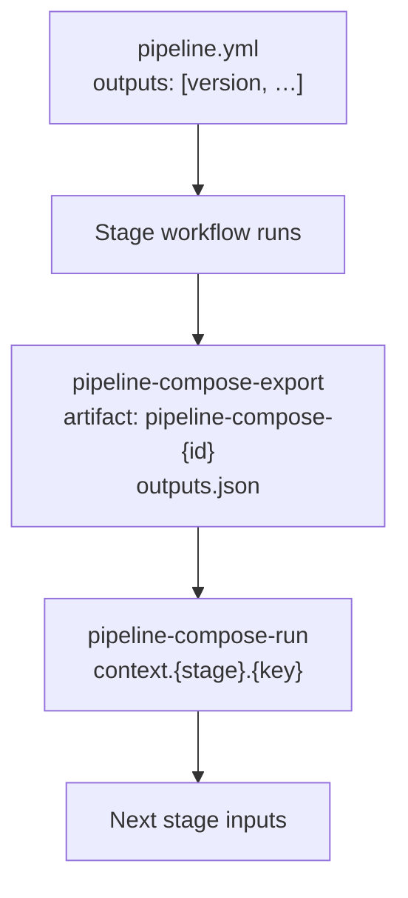

# pipeline-compose-export

**Upload stage results so the next pipeline step can use them** — one action step instead of hand-written `jq` and artifact YAML.

Required companion to [pipeline-compose-run](https://github.com/aeswibon/pipeline-compose-run) whenever a stage passes data forward.

Part of [pipeline-compose](https://github.com/aeswibon/pipeline-compose).

---

## Do I need this?

**Yes, if** your pipeline stage has an **`outputs:`** list (e.g. `version`) and a later stage uses **`${{ context.my-stage.version }}`**.

**No, if** the stage is last in the chain and nothing reads its data, **or** you’re not using **pipeline-compose-run**.

You need **one export step per stage** that declares **`outputs`** — usually at the **end** of the stage job, with **`if: success()`**.

---

## How it works



GitHub does **not** let you read another workflow run’s job **`outputs`**. This artifact is the bridge.

---

## First-time setup checklist

- [ ] Pipeline stage has **`outputs:`** listing every key you will send  
- [ ] **`stage_id`** here **exactly matches** stage **`id`** in pipeline YAML  
- [ ] **`outputs`** input is valid JSON **object** (not array)  
- [ ] Keys in JSON match pipeline **`outputs`** names  
- [ ] Step runs **`if: success()`** so failed jobs don’t publish bad data  
- [ ] Stage workflow has **`workflow_dispatch`** (run dispatches it)

---

## Quick start

**Pipeline:**

```yaml
- id: version-sync
  workflow: .github/workflows/stage-version-sync.yml
  needs: [ci]
  outputs:
    - version
    - skip_publish
```

**Stage workflow (last steps):**

```yaml
- id: meta
  run: |
    echo "version=1.2.3" >> "$GITHUB_OUTPUT"
    echo "skip_publish=false" >> "$GITHUB_OUTPUT"

- uses: aeswibon/pipeline-compose-export@v1.17.0
  if: success()
  with:
    stage_id: version-sync
    outputs: >-
      {"version":"${{ steps.meta.outputs.version }}",
       "skip_publish":"${{ steps.meta.outputs.skip_publish }}"}
```

**Downstream pipeline wiring:**

```yaml
inputs:
  version: ${{ context.version-sync.version }}
```

Downstream stage **`workflow_dispatch` inputs** must declare `version` (and types) in GitHub’s workflow YAML.

---

## Glossary

| Term | Plain English |
|------|----------------|
| **`stage_id`** | Same as stage **`id`** in pipeline file. Wrong id → run can’t find artifact. |
| **Pipeline `outputs`** | Keys you **promise** to send. Document only — export **creates** the values. |
| **`outputs` (input)** | JSON object string, e.g. `'{"version":"1.0.0"}'`. All values should be strings. |
| **`outputs.json`** | File inside the artifact. Must be a JSON **object**, not `[...]`. |
| **Artifact name** | Always **`pipeline-compose-<stage_id>`**. Don’t rename. |
| **`context`** | After export, run stores your JSON under **`context.<stage_id>.<key>`**. |

---

## Common questions

**Why both `outputs` in pipeline and this action?**  
Pipeline **`outputs`** = contract (“this stage provides `version`”). Export **input** = actual values this run produced.

**Can I use `toJson(steps.x.outputs)`?**  
Yes, if the result is a flat object whose keys match pipeline **`outputs`**.

**Stage has no downstream consumers — still export?**  
No. Omit pipeline **`outputs`** and skip this action.

**Manual upload instead?**  
Yes — same artifact name and **`outputs.json`** path. Export just avoids copy-paste mistakes.

---

## Troubleshooting

| Symptom | Fix |
|---------|-----|
| Next stage: empty input | **`stage_id`** typo; or export didn’t run (`if: success()`) |
| Run log: artifact not found | Export step missing or failed |
| Invalid JSON error | **`outputs`** input must be one JSON object string |
| Key missing in context | Key not listed in pipeline **`outputs`** or not in JSON |

---

## Inputs

| Input | Required | Description |
|-------|----------|-------------|
| `stage_id` | yes | Pipeline stage **`id`** |
| `outputs` | yes | JSON object string |
| `validate_schema` | no | When `true`, validate `outputs` against `context_schema_json` before upload |
| `context_schema_json` | no | Full pipeline `context_schema` object (required when `validate_schema` is true) |

## What it creates

- Runner file: `pipeline-compose/outputs.json`  
- Artifact: **`pipeline-compose-<stage_id>`**

---

## Related actions

| Action | Role |
|--------|------|
| [pipeline-compose-run](https://github.com/aeswibon/pipeline-compose-run) | Orchestrator; reads this artifact |
| [pipeline-compose-context-merge](https://github.com/aeswibon/pipeline-compose-context-merge) | Different — local file in one workflow, not for run |

## License

[MIT](LICENSE)
